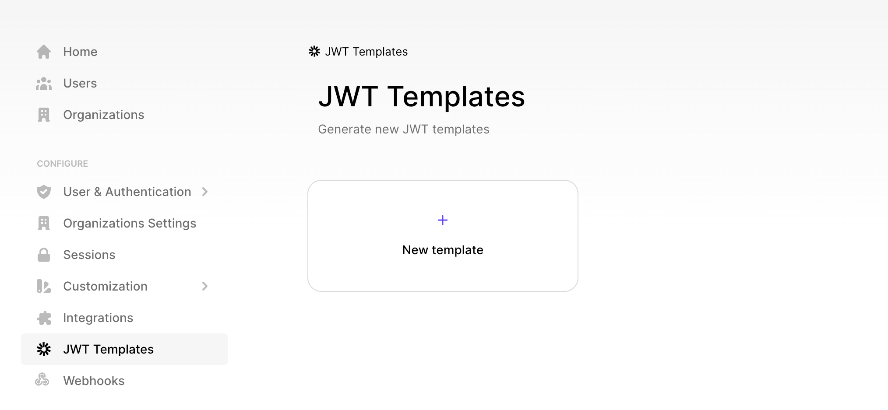

# Project Setup Guide

Rename the `.env.example` file to `.env` and fill in the required values.

## Clerk Configuration

### Sign Up for Clerk

[Sign up for a free Clerk account](https://clerk.com/sign-up).

### Create an Application

Navigate to the Clerk dashboard and create a new application. Choose the authentication methods that suit your needs.

### Generate JWT Template

1. In the JWT Templates section of the Clerk dashboard, click on **+ New template**.
2. Choose "Convex" from the options.
3. Copy the Issuer URL displayed in the Issuer input field.
4. Click **Apply Changes**.



### Create Auth Config

Create a new file named `auth.config.js` inside the `convex` folder. This file will contain server-side configurations for token validation.

convex/auth.config.js

```javascript
export default {
  providers: [
    {
      domain: "https://your-issuer-url.clerk.accounts.dev/",
      applicationID: "convex",
    },
  ]
};
```

## Start the Dev Server

```bash
npm run dev
```

and on a seperate terminal run

```bash
npx convex dev
```
